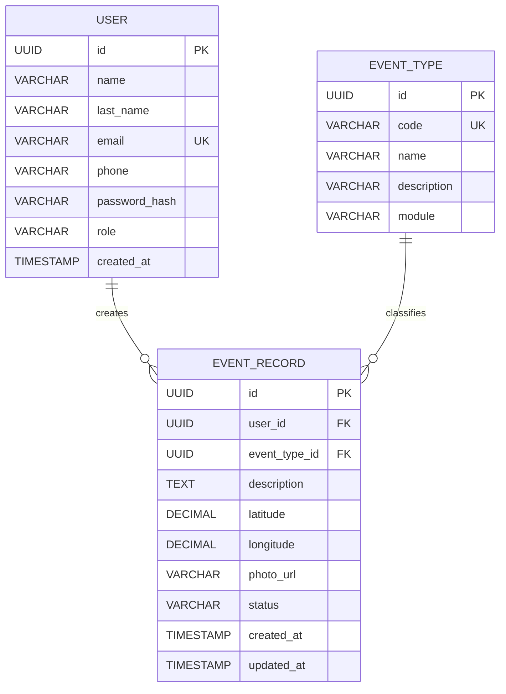

# SmartSafe
## Modelo de Datos

## 1. Objetivo

Definir el modelo de persistencia inicial para SmartSafe.

El diseño busca soportar SmartReport y SmartSOS con el menor número posible de entidades.

---

## 2. Entidades principales

El MVP utilizará tres entidades principales:
- User
- EventType
- EventRecord

---

## 3. Diagrama conceptual

```text
USER
 1
 │
 │
 N
EVENT_RECORD
 N
 │
 │
 1
EVENT_TYPE
```

---

## 4. User

Representa a los usuarios de SmartSafe.

| Campo | Tipo | Restricción |
|---|---|---|
| id | UUID | PK |
| name | VARCHAR(100) | NOT NULL |
| last_name | VARCHAR(100) | NOT NULL |
| email | VARCHAR(150) | UNIQUE, NOT NULL |
| phone | VARCHAR(20) | NULL |
| password_hash | VARCHAR(255) | NOT NULL |
| role | VARCHAR(20) | NOT NULL |
| created_at | TIMESTAMP | NOT NULL |

Valores de role:
- CITIZEN
- OPERATOR

---

## 5. EventType

Catálogo de tipos de eventos.

| Campo | Tipo | Restricción |
|---|---|---|
| id | UUID | PK |
| code | VARCHAR(50) | UNIQUE, NOT NULL |
| name | VARCHAR(100) | NOT NULL |
| description | VARCHAR(500) | NULL |
| module | VARCHAR(20) | NOT NULL |

Valores de module:
- SMART_REPORT
- SMART_SOS

---

## 6. Tipos iniciales de SmartReport

| code | name |
|---|---|
| POTHOLE | Bache |
| WASTE | Residuos acumulados |
| STREET_LIGHT | Alumbrado público |
| WATER_LEAK | Fuga de agua |

---

## 7. Tipos iniciales de SmartSOS

| code | name |
|---|---|
| MEDICAL | Emergencia médica |
| ACCIDENT | Accidente |
| FIRE | Incendio |
| PERSONAL_SECURITY | Seguridad personal |

---

## 8. EventRecord

Representa una ocurrencia concreta de un evento.

| Campo | Tipo | Restricción |
|---|---|---|
| id | UUID | PK |
| user_id | UUID | FK, NOT NULL |
| event_type_id | UUID | FK, NOT NULL |
| description | TEXT | NULL |
| latitude | DECIMAL(9,6) | NOT NULL |
| longitude | DECIMAL(9,6) | NOT NULL |
| photo_url | VARCHAR(500) | NULL |
| status | VARCHAR(30) | NOT NULL |
| created_at | TIMESTAMP | NOT NULL |
| updated_at | TIMESTAMP | NOT NULL |

Relaciones:

```text
User.id
   ↓
EventRecord.user_id
```

```text
EventType.id
   ↓
EventRecord.event_type_id
```

---

## 9. Estados SmartReport

- REPORTED
- IN_PROGRESS
- RESOLVED

Flujo:

```text
REPORTED
   ↓
IN_PROGRESS
   ↓
RESOLVED
```

---

## 10. Estados SmartSOS

- ACTIVE
- IN_PROGRESS
- FINISHED

Flujo:

```text
ACTIVE
   ↓
IN_PROGRESS
   ↓
FINISHED
```

---

## 11. UrbanEvent

UrbanEvent no será inicialmente una tabla física.

Será un DTO construido a partir de EventRecord y EventType.

Ejemplo:

```json
{
  "id": "uuid",
  "source": "SMART_REPORT",
  "type": "POTHOLE",
  "latitude": -13.5204,
  "longitude": -71.9751,
  "status": "REPORTED",
  "timestamp": "2026-09-05T20:00:00-05:00"
}
```

Esta decisión evita duplicación de datos.

---

## 12. Diagrama ER



---

## 13. Consideraciones futuras

En versiones posteriores podrían incorporarse:
- historial de estados;
- múltiples fotografías;
- dependencias responsables;
- contactos de emergencia;
- auditoría;
- notificaciones.

Estas entidades no forman parte del MVP.
